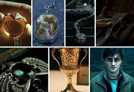
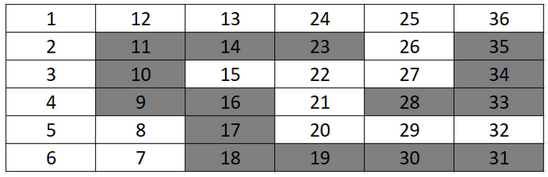
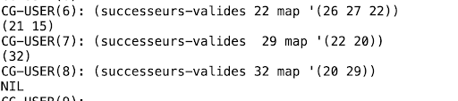
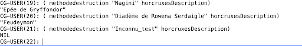
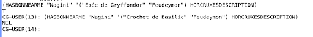

# Harry, Voldemort et Dumbledore à la recherche des Horcruxes

A student project in which Harry Potter and Voldemort search Horcruxes in a map represented as a state space with different algorithms.  
This is a student project, made in a limited period and stopped.



## Creation
14/11/2023

## Last modification of the code
20/11/2023

## Author
Simon Biffe

## Contributor
Inès Adam

## What are rules?

### Problem Statement
Harry Potter and Lord Voldemort are searching for Horcruxes on a map. Each square on the map represents a room or a location. Harry Potter will use a depth-first search algorithm to find and destroy Horcruxes. He can only move to adjacent squares (up, right, down, or left). Grayed-out squares are not accessible. For example, from state 22, Harry can move to 27, 21, and 15. Lord Voldemort, on the other hand, can move in any direction except on grayed-out squares.

The number of attempts is limited to a specified depth (7 here, with the entry level being 0). For this project, we have the following map, but the program should be able to handle any map represented in a similar way.



Each Horcrux can be destroyed by a unique destruction method. Here is the description of the Horcruxes and their associated destruction methods:

- Journal intime de Tom Jedusor (Tom Riddle's Diary): Destruction method : Crochet de Basilic (Basilisk Hook)
- Médaillon de Salazar Serpentard (Salazar Slytherin's Locket): Destruction method : Epée de Gryffondor (Gryffindor's Sword)
- Bague de Gaunt (Gaunt's Ring): Destruction method : Epée de Gryffondor (Gryffindor's Sword)
- Coupe de Helga Poufsouffle (Helga Hufflepuff's Cup): Destruction method : Crochet de Basilic (Basilisk Hook)
- Nagini: Destruction method : Epée de Gryffondor (Gryffindor's Sword)
- Diadème de Rowena Serdaigle (Rowena Ravenclaw's Diadem): Destruction method : Feudeymon (Fiendfyre)
- Harry Potter: Destruction method : Sortilège de la Mort (Killing Curse)

The Horcruxes are hidden in the following squares:

- Journal intime de Tom Jedusor: 8
- Médaillon de Salazar Serpentard: 12
- Bague de Gaunt: 15
- Coupe de Helga Poufsouffle: 22
- Nagini: 26
- Diadème de Rowena Serdaigle: 29

The seventh Horcrux, Harry Potter, is mobile.

A destruction method can destroy multiple Horcruxes. Four destruction methods are hidden in the following squares:

- Crochet de Basilic: 3
- Sortilège de la Mort: 20
- Epée de Gryffondor: 25
- Feudeymon: 32

When arriving on a square, it's possible to acquire a destruction method if available. If arriving on a square for the first time, having the appropriate destruction method allows the destruction of the Horcrux (e.g., if on square 26, the Gryffindor's Sword is needed to destroy Nagini). It is not possible to destroy it if it's not the first time on that square. For example, passing the first time on square 12 without the Gryffindor's Sword means it cannot be destroyed. If returning a second time with the sword, it will be too late to destroy it.

Lord Voldemort will also explore the map. With each movement of Harry Potter to a new square, Lord Voldemort will move simultaneously. When Harry retraces his steps, Lord Voldemort does not move. The user must choose Lord Voldemort's square. The depth is always limited to 7.

Lord Voldemort can also collect weapons and destroy Horcruxes. Like Harry Potter, he can only destroy the Horcrux if:
- He has already collected the appropriate destruction method, and
- It's the first time he has come to that square.

However, the rules are different for the Harry Potter Horcrux. Lord Voldemort can destroy Harry Potter with the Killing Curse if he arrives on the same square, even if he has been there before. If Harry Potter dies, the game ends.

### Problem Representation

Four different lists will represent 1) the map, 2) the description of the Horcruxes, 3) the placement of the Horcruxes on the map, and 4) the placement of the destruction methods on the map.

Here are examples for each corresponding to the reference map.

(setq map '((1 12 2)(2 1 3)(3 2 4)(4 3 5)(5 4 8 6)(6 5 7)(7 8 6)(8 7 5)(12 13 1)
            (13 24 12)(15 22)(20 21 29)(21 22 20)(22 27 21 15)(24 25 13)
            (25 36 26 24)(26 25 27)(27 26 22)(29 32 20)(32 29)(36 25)))

 
(setq horcruxesDescription '(("Journal intime de Tom Jedusor" 
                                (methodeDestruction "Crochet de Basilic"))
                             ("Médaillon de Salazar Serpentard" 
                                (methodeDestruction "Epée de Gryffondor"))
                             ("Bague de Gaunt" 
                                (methodeDestruction "Epée de Gryffondor"))
                             ("Coupe de Helga Poufsouffle" 
                                (methodeDestruction "Crochet de Basilic"))
                             ("Nagini" 
                                (methodeDestruction "Epée de Gryffondor"))
                             ("Diadème de Rowena Serdaigle" 
                                (methodeDestruction "Feudeymon"))))

(setq horcruxesMap '((8 "Journal intime de Tom Jedusor")
                     (12 "Médaillon de Salazar Serpentard")
                     (15 "Bague de Gaunt")
                     (22 "Coupe de Helga Poufsouffle")
                     (26 "Nagini")
                     (29 "Diadème de Rowena Serdaigle")))

(setq armesMap '((3 "Crochet de Basilic")
                 (32 "Feudeymon")
                 (25 "Epée de Gryffondor")
                 (20 "Sortilège de la Mort")))    

## Usage
Next, some examples of interesting requests.  
Each structure and different parameters' options are more detailled in commentary of each function in the code.  

The names map, horcruxesDescription, horcruxesMap et armesMap match with the test variables de test proposées dans le sujet du TP2. Toute variable ayant une structure similaire peut leur être substituée au sein des appels de fonction.

### Utility Functions:
( successeurs-valides 22 map '(26 27 28))
( methodedestruction “Nagini” horcruxesDescription)
( hasbonneArme “Nagini” '(“Epée de Gryffondor” “Feudeymon”) Horcruxesdescription)

### Function RechercheProfondeur:
(rechercheprofondeur 1 map horcruxesMap armesMap horcruxesDescription)
(rechercheprofondeur 24 map horcruxesMap armesMap horcruxesDescription)
(rechercheprofondeur 1 map horcruxesMap armesMap horcruxesDescription :horcruxesDetruits NIL :profondeur 2)
(rechercheprofondeur 1 map horcruxesMap armesMap horcruxesDescription :affichage "events")

### Fnction rechercheProfondeurVoldemort:
(rechercheprofondeurVoldemort 1 3 map horcruxesMap armesMap horcruxesDescription)
(rechercheprofondeurVoldemort 1 3 map horcruxesMap armesMap horcruxesDescription :affichage "log-arbre")

### Function rechercheProfondeur+:
(rechercheprofondeur+ 1 map horcruxesMap armesMap horcruxesDescription :profondeurMax 3)
(rechercheprofondeur+ 1 map horcruxesMap armesMap horcruxesDescription :profondeurMax 12 :affichage "events-arbre")
(rechercheprofondeur+ 24 map horcruxesMap armesMap horcruxesDescription)
(rechercheprofondeur+ 1 map horcruxesMap armesMap horcruxesDescription :horcruxesDetruits NIL :profondeur 2)
(rechercheprofondeur+ 1 map horcruxesMap armesMap horcruxesDescription :affichage "events")
(rechercheprofondeur+ 1 map horcruxesMap armesMap horcruxesDescription :profondeurMax 12 :fluxSortie "test32.txt" :affichage "events")

### Function rechercheProfondeurVoldemort+ :
(rechercheprofondeurVoldemort+ 1 3 map horcruxesMap armesMap horcruxesDescription)
(rechercheprofondeurVoldemort+ 1 36 map horcruxesMap armesMap
horcruxesDescription :affichage "log-arbre" :profondeurMax 9 :fluxSortie "test333.txt")

### Function rechercheProfondeur++:
(rechercheprofondeur++ 1 map horcruxesMap armesMap horcruxesDescription
:profondeurMax 7 :dumbledore T :caseD 1)
(rechercheprofondeur++ 1 map horcruxesMap armesMap horcruxesDescription
:profondeurMax 7 :dumbledore T :caseD 1 :modeD "parallele")

## Detailed Documentation

This section was originally written in French so some errors could be rested in the traduction. Sorry previously.

### Utility Functions

#### successeurs-valides



This function takes an integer representing a square, a map as a list of squares, each square represented by a list containing its number and the numbers of its successors, and a traversed path as a list of squares, each square represented by its number.  
From the square number and the map passed as parameters, it iterates through each successor of the square, checks if it has already been traversed, and adds it to the valid successors. The order of the valid successors list is then reversed to match the original order of successors in the map, and this list is returned.  
If a square not present in the map is passed as a parameter, the function returns NIL.

#### methodeDestruction



This function takes an Horcrux as a string and a list indicating the suitable destruction method for each Horcrux as a list of pairs (Horcrux weapon), each represented by a string.  
It checks if a pair starting with the string passed as a parameter exists in the description list, and if so, returns the second element of the pair, i.e., the associated destruction method. Otherwise, it returns NIL.


#### hasBonneArme



This function takes an Horcrux as a string, a list of possessed destruction methods represented as strings, and a list indicating the suitable destruction method for each Horcrux as a list of pairs (Horcrux weapon), each represented by a string.  
Using methodeDestruction, it looks for the destruction method associated with the tested Horcrux and checks if it is part of the list of possessed methods, then returns the boolean result of this check. Note that if a string not listed as an Horcrux in the Horcruxes description list is passed as a parameter, methodeDestruction returns NIL, and hasBonneArme also returns NIL.

### Depth-First Search for Harry Potter

#### Algorithm

The main difficulty of this depth-first search lies in transmitting and, especially, retrieving information through different recursive calls.

We identified three possibilities:
- The use of global variables  
However, we considered this solution to be avoided, mainly because this behavior might not be very intuitive for the user.
- Passing modified information by return value  
From our point of view, this is the simplest solution to implement, but it can lead to overloading the value returned by the function. We used it to handle modifications to destroyedHorcruxes and possessedWeapons, which are required anyway.
- Using side effects by exploiting the mutable property of lists  
Exploiting the mutable property of lists in Lisp allows updating the necessary information directly from one recursive call to another, without relying on a returned value. This method has several advantages:
  - Since each list is created only once, it saves memory space.
  - As there is no need to copy return values, the number of operations to be performed is reduced.
  - It avoids "polluting" the return value by only returning values useful for the end-user.
  - In theory, if the end-user still wants to retrieve the final value of a list managed by side effects, they can do so by passing a pre-defined list stored previously in a variable as a parameter.

However, we acknowledge one drawback, which is modifying the value of a list possibly passed as a parameter and therefore requiring a copy. This drawback is, however, addressed by using optional parameters since the end-user no longer risks passing a pre-defined variable as a parameter and modifying it without deciding to do so.

In the end, we made a compromise by managing destroyedHorcruxes and possessedWeapons, which are required return values, by passing information by return value and managing the other data involved, here only traversedPath, by side effects.

The resulting algorithm is as follows:

```lisp
RechercheProfondeur
    Parameters:
        Mandatory:
            square: integer
            map: list (adjacency)
            horcruxesMap: association list
            weaponsMap: association list
            horcruxesDescription: association list
        Optional:
            depth: integer (default 0)
            traversedPath: list (default empty list)
            possessedWeapons: list (default empty list)
            destroyedHorcruxes: list (default empty list)
    Start:
        #Processing the active square
        Add square to traversedPath
        weaponSquare <- assoc(square, weaponsMap)
        horcruxSquare <- assoc(square, horcruxesMap)
        If weaponSquare:
            Add the second element of weaponSquare to possessedWeapons
        EndIf
        If horcruxSquare and hasCorrectWeapon(cadr(horcruxSquare), possessedWeapons, horcruxesDescription):
            Add the second element of horcruxSquare to destroyedHorcruxes
        EndIf

        #Search and processing of valid successors (not already traversed in particular)
        If depth < 7 then for each valid successor succ of square:
            tmp <- RechercheProfondeur(succ, map, horcruxesMap, weaponsMap, horcruxesDescription, depth + 1, traversedPath, possessedWeapons, destroyedHorcruxes) 
            #No risk of duplication of horcruxes and weapons since each is positioned on only one square, and we only check each square once thanks to traversedPath (to be modified if this rule of uniqueness of horcruxes were to change)
            Replace destroyedHorcruxes with the first element of tmp
            Replace possessedWeapons with the second element of tmp
        EndFor
        Return (destroyedHorcruxes possessedWeapons)
    End
```

#### Lisp

The Lisp function, named `rechercheProfondeur` in the associated code, has five main steps:
- Checking the validity of the arguments passed as parameters
- Processing of the active square  
We add the active square to the traversed path, then we add the Horcrux or the destruction method to the destroyed Horcruxes or the possessed weapons, respectively, if there is one on the active square and if we possess the required destruction method in the case of a Horcrux.
- Display of the active state  
Having worked separately on the project for some time, we realized when merging the code that we had adopted a very different display principle: Inès, in a more playful approach, displayed actions accompanied by comments when they occurred, while Simon, in an approach of contextualization, displayed the active state at each square.  
Rather than choosing one of the two principles, we chose to make them coexist by offering the user to choose a display mode using an optional parameter. Four modes are finally proposed:
    - “log”  
    Displays for each square the number of the active square, the destroyed horcruxes, and the possessed destruction methods.
    - “log-arbre””
    Same mode as “log” but shifts each display by as many spaces as the depth to better represent the depth-first search.
    - “events”  
    Displays the encountered events (active square, destroyed horcrux, encountered horcrux without the correct weapon…).
    - “events-arbre”
    Same mode as “events” but shifts each display by as many spaces as the depth to better represent the depth-first search.

    The default mode is "log-arbre".

- The possible treatment of successors  
We check that the depth has not reached the maximum value, currently set to 7, then we search for all successors that have not already been traversed. For each of them, we check again that it has not been traversed in a path starting from another successor, done after the search for valid successors. Then we call the function again to perform a depth-first search from this successor, incrementing the depth. We retrieve the return value and use it to update the list of possessed methods and the list of destroyed Horcruxes.

- Returning the list of destroyed Horcruxes and possessed destruction methods

Updating the traversed path by side effect was the main difficulty encountered during the development of this function. Indeed, most native functions in Lisp protect against side effects, which are generally an unexpected event for the developer and not desired by the end user. Thus, it seemed to us that even if they seem to modify the list passed as a parameter, which we will call *alpha*, most functions similar to push make a copy of *alpha*, modify it, and make this copy the new value of *alpha*. However, this assignment is valid only within the current variable scope, that is, here, the function and all functions called within it that take *alpha* as a parameter. As a result, *alpha* will not have changed in the higher scope, where the function was called, whether it be the main process or a previous parent call of the function.
This is a problematic behavior in the current subject because, while we could handle the list of destruction methods like this, for example, only displaying messages when one is retrieved without a return value, the retrieval of Horcruxes is often conditioned on possessing a destruction method retrieved in a parallel recursive call, which would then not be known.

To bypass these protections set up by standard functions, we had to directly replace, using setf, the cdr of the last cell of the list to be modified, here cheminParcouru, with the case to add. In addition, this case must be previously converted into a list. Otherwise, it does replace the cdr of cheminParcouru, but additional cases cannot be added to it. We believe this is because it does not have a cdr and just replaces the NIL-valued cdr of cheminParcouru with its value, whereas conversion turns it into a pair (case, NIL).

While it works in practice, this solution does not preserve all the advantages envisioned during the development of the algorithm. Indeed, in Lisp, an empty list is not a pair of values but the value NIL. Also, it is impossible to extract, and even less to modify, the cdr. To ensure the operation of the function even in the case of an empty list, a case generally present during the first call to the function since it is the default state of cheminParcouru, we check if the list was null. If so, we assign to cheminParcouru the value of the case converted into a list. The behavior of this list is then correct within this function and its recursive calls, but its value is not modified outside the function. Thus, if a user wants to retrieve the traversed path in a variable, they cannot pass a null variable as a parameter; they are forced to pass a list containing any object, for example, the value 0, and to only retrieve the cdr of this object after the function call to eliminate the any object. Despite our tests and research, we have been unable to find a convincing solution to this problem that seems to arise from the very nature of the representation of lists in Lisp.

### Lord Voldemort embarks on the quest for the Horcruxes

#### Algorithm

The function RechercheProfondeurVoldemort performs a depth-first traversal of the game map, represented by the variable "carte" (map), to find and destroy the Horcruxes. Harry's position is indicated by the variable "caseHarry," and Voldemort's by "caseVoldemort." The function also takes into account a map of the Horcruxes ("carteHorcruxes"), a map of the destruction methods ("carteArmes"), and a description of the Horcruxes ("descriptionHorcruxes").

During the traversal, the function updates the lists of destruction methods and destroyed Horcruxes for both Harry and Voldemort. It also displays information at each step, depending on the specified display mode.

### Lord Voldemort embarks on the quest for the Horcruxes

#### Algorithm

We reused the same framework as for the RechercheProfondeurVoldemort function, so all the assumptions made earlier remain valid.

We started with the RechercheProfondeur function, to which we added the parameters related to Voldemort as function parameters. The key difference here is to be consistent with the methods possessed by Voldemort. We chose the exclusivity of weapons: a method owned by one player cannot be acquired by another.

```markdown
RechercheProfondeur
    Parameters:
        Mandatory:
            caseHarry: integer
            caseVoldemort: integer
            carte: list (adjacency)
            carteHorcruxes: association list
            carteArmes: association list
            descriptionHorcruxes: association list
        Optional:
            profondeur: integer (default 0)
            cheminParcouruHarry: list (default empty list)
            armesPossedeesHarry: list (default empty list)
            horcruxesDetruitsHarry: list (default empty list)
            cheminParcouruVoldemort: list (default empty list)
            armesPossedeesVoldemort: list (default empty list)
            horcruxesDetruitsVoldemort: list (default empty list)
    Start:
        # Checking the end of the game
        If (caseHarry = caseVoldemort) and ("Avada Kedavra" belongs to armesPossedeesVoldemort):
            Stop the program and return "Harry Potter killed"
        EndIf
        # Processing Harry's active case
        Add case to cheminParcouruHarry
        armeCase <- assoc(caseHarry, carteArmes)
        horcruxeCase <- assoc(caseHarry, carteHorcruxes)
        If armeCase and the weapon is not owned by Voldemort:
            Add the second element of armeCase to armesPossedesHarry
        EndIf
        If horcruxeCase and hasBonneArme(cadr(horcruxeCase), armesPossedesHarry, descriptionHorcruxes):
            Add the second element of horcruxeCase to horcruxesDetruitsHarry
        EndIf
        # Processing Voldemort's active case
        Add case to cheminParcouruVoldemort
        armeCase <- assoc(caseVoldemort, carteArmes)
        horcruxeCase <- assoc(caseVoldemort, carteHorcruxes)
        If armeCase and the weapon is not owned by Harry:
            Add the second element of armeCase to armesPossedesVoldemort
        EndIf
        If horcruxeCase and hasBonneArme(cadr(horcruxeCase), armesPossedesVoldemort, descriptionHorcruxes):
            Add the second element of horcruxeCase to horcruxesDetruitsVoldemort
        EndIf
        # Search and processing of valid successors (not already traversed)
        If profondeur < 7 then for each valid successor "succ" of case:
            Enter inputCaseVoldemort
            tmp <- RechercheProfondeur(succ, inputCaseVoldemort, carte, carteHorcruxes, carteArmes, descriptionHorcruxes, profondeur + 1, cheminParcouruHarry, armesPossedesHarry, horcruxesDetruitsHarry, cheminParcouruVoldemort, armesPossedesVoldemort, horcruxesDetruitsVoldemort)
            # No risk of duplication of horcruxes and weapons as each is positioned on a single case, and we check each case only once thanks to cheminParcouru (to be modified if this rule of uniqueness of horcruxes were to change)
            Replace horcruxesDetruitsHarry with the first element of tmp
            Replace armesPossedeesHarry with the second element of tmp
            Replace horcruxesDetruitsVoldemort with the third element of tmp
            Replace armesPossedeesVoldemort with the fourth element of tmp
            Replace caseVoldemort with the fifth element of tmp
        EndFor
        Return (horcruxesDetruitsHarry armesPossedesHarry horcruxesDetruitsVoldemort armesPossedesVoldemort caseVoldemort)
    End
```

#### Lisp

We started with the DepthFirstSearch function, to which we added the parameters related to Voldemort as function parameters. Therefore, it is necessary to follow the paths of Harry and Voldemort with "caseHarry" and "caseVoldemort," which will be stored in "cheminParcouruHarry" and "cheminParcouruVoldemort" (empty at the beginning).

The main steps of the code are as follows:
- Verification of the argument types passed as parameters
- Endgame test  
A preliminary test checks if Harry and Voldemort are on the same square, and if Voldemort possesses the "Avada Kedavra" spell, signifying Voldemort's victory and thus, the end of the game. We chose to use the "return-from" function to exit the loop directly and return the failure message for Harry.
- Processing of Harry's active case  
Here, we reuse the same code as for DepthFirstSearch to add Harry's current position to his path and manage the method possibly acquired and/or the destroyed Horcrux according to the weapons owned by Voldemort. Indeed, they cannot pick up the same method. However, Harry can destroy a Horcrux that Voldemort has already encountered, and vice versa.
- Display of the active case  
Here too, we reused the previous method with the four possible modes.
- Processing of Voldemort's active case  
We store Voldemort's case in the same way as Harry's position, adding it to the path. We also manage the exclusivity of methods/horcruxes in the same way, making sure that one does not already belong to Harry.
- Display of the active case  
Similar to the approach in DepthFirstSearch above.
- Possible processing of successors  
We check that the depth has not reached the maximum value and that all the Horcruxes have not already been found by Harry. This ensures that the search continues until all the Horcruxes are destroyed.
If so, we look for all successors that have not already been traversed by Harry.
Next, we process the squares adjacent to where Voldemort is to determine his movement options. If these two conditions are satisfied, the function uses a dolist loop to traverse the valid successors of the current square. A successor is considered valid if it has not already been traversed. After displaying Voldemort's movement options, we ask the user to choose one of these squares to define the successor to Voldemort's current square.
Then, we call the function again to perform a depth search from these successors by incrementing the depth. We retrieve the return value and use it to update the list of possessed methods and the list of destroyed Horcruxes for Harry and Voldemort. We also update Voldemort's square based on the return. Otherwise, we encounter the problem of information retrieval detailed above, which cannot be solved this time by side effects, as integers are non-mutable, unlike lists.

### Dumbledore and Breadth-First Search

We introduced a variant of Harry's depth-first search function, named rechercheProfondeur++, and available in the code, where Dumbledore can be added to the game.  
This function takes the mandatory parameters of the rechercheProfondeur function and the following optional parameters:
- All parameters from rechercheProfondeur
- :dumbledore, which expects a boolean and allows Dumbledore to be considered (T) or not (NIL) in the game. If it is NIL, the function operates strictly similarly to rechercheProfondeur+.
- :caseD, which expects an integer representing Dumbledore's active square
- :fileD, which expects a list of squares represented by integers and represents the list of successors to be traversed in order
- :cheminParcouruD, which expects a list of squares represented by integers and represents the list of squares already traversed by Dumbledore
- :armesPossedeesD, which expects a list of strings representing methods of destruction collected by Dumbledore
- :horcruxesDetruitsD, which expects a list of strings representing horcruxes destroyed by Dumbledore
- :modeD, which expects a string and represents Dumbledore's mode of interaction. Two modes exist:
    - "collab": Dumbledore and Harry Potter coexist on the board, each method of destruction and Horcrux can only be picked up by one of them. They can potentially collect more Horcruxes but can also interfere with each other if one of them collects the required method of destruction for the other. It is noteworthy that even if Harry Potter encounters a Horcrux that he cannot destroy due to a lack of the appropriate destruction method in his possession, Dumbledore can destroy it during his first visit to that square and vice versa.
    - "parallel": Dumbledore and Harry Potter do not coexist, and the same methods of destruction and Horcruxes can be collected by both. This mode allows for a comparison of the efficiency of each type of traversal.

The default value is "collab".

- Processing the active square for Harry Potter  
Similar to rechercheProfondeur, we add the active square to the traversed path. Then, we add the Horcrux or the destruction method to the destroyed Horcruxes or possessed weapons, respectively, if there is one on the active square and if we have the required destruction method in the case of a Horcrux. However, if Dumbledore is present and in "collab" mode, we check before adding the Horcrux or the destruction method that they are not in the Horcruxes already destroyed or the destruction methods collected by Dumbledore.

- Processing the active square for Dumbledore  
We proceed similarly to Harry, then we add the valid successors of Dumbledore's active square to the queue of squares to be traversed.

- Displaying current data or changes according to the chosen display mode

- Recursive calls  
We check if the depth has not reached the maximum value passed as a parameter, by default set to 7. As with rechercheProfondeur, we search for all successors of Harry Potter's active square that have not already been traversed. For each of them, we recursively call the function to perform a depth search from this successor, incrementing the depth.  
If Dumbledore's queue of squares to traverse is not empty, we pass its first element as an argument for the :caseD parameter and its queue without the first element as an argument for the :fileD parameter. We then retrieve the return value and use it to update the list of methods possessed by Harry, the list of Horcruxes destroyed by Harry, the list of methods possessed by Dumbledore, the list of Horcruxes destroyed by Dumbledore, and the queue of squares to traverse by Dumbledore.  
However, if Dumbledore's queue of squares to traverse is empty, we simply make a straightforward call to rechercheProfondeur++ with the dumbledore parameter set to NIL. Nevertheless, we pass armesPossedeesD, horcruxesDetruitsD, and modeD as parameters in case Dumbledore's mode is "collab," and Harry Potter must, therefore, check that the destruction methods and Horcruxes have not already been retrieved.

- Returning the list of methods possessed by Harry, the list of Horcruxes destroyed by Harry, the list of methods possessed by Dumbledore, the list of Horcruxes destroyed by Dumbledore, and the queue of squares to traverse by Dumbledore

Initially, we wanted to manage the queue by side effects, like the paths traversed by Harry Potter and Dumbledore, but the pop function also avoids side effects, and handling the shifting of values in a list to remove the first element is complex. Therefore, we chose to manage it through the return value.

We did not develop a similar variant for the depth search function considering Voldemort because we felt that sharing destruction methods between three entities would risk limiting the possibility of destroying Horcruxes too much. However, it would have been entirely possible to proceed in a similar manner.

### Choosing the Maximum Depth

Firstly, we chose to allow the user to determine the maximum depth level for Harry's depth-first search. Beyond the ease of implementing this addition, it seemed very interesting to assess the impact of the depth level on the results obtained for different squares, especially compared to the default depth level of 7.

We implemented this choice using an optional parameter :profondeurMax, expecting an integer, and added it within the functions rechercheProfondeur+, rechercheProfondeurVoldemort+, and rechercheProfondeur++. The prior depth test before processing the successors is then modified as follows:

```lisp
    ;Checking that the maximum depth has not been reached and that all Horcruxes have not already been found
    (if (and (< profondeur profondeurMax) (< (length horcruxesDetruits) 6))
```

### Writing to a File

For testing and backup purposes, we wanted to offer users the option to perform the displays in a file rather than the console.

Within the functions rechercheProfondeur+, rechercheProfondeurVoldemort+, and rechercheProfondeur++, we introduced an optional parameter :fluxSortie, expecting T or a string corresponding to the path of a file, existing or to be created. All calls to the native format function with T as the first parameter within the concerned functions were then replaced by a call to a new function display with fluxSortie as the first parameter. The other parameters remain unchanged.

After verifying the validity of the parameters, we test if the sortie parameter corresponds to T, the terminal, or a string. In the first case, we make a simple call to format passing T as the first parameter. In the second case, we open a file (or create it if it doesn't exist), write to the end of its content using format with the opened file as the first parameter, and close the file. The opening and closing of the file are done automatically using the with-open-file function, which closes the file even in case of an error.

Thanks to the &rest keyword, all arguments passed as parameters after the first one are stored in the params list before being individually passed as parameters to format using the apply function.

This option of writing displays to a file is compatible with all previously presented display modes. However, in rechercheProfondeurVoldemort+, the listing of Voldemort's possible squares and the choice dialogues are kept in the console to save the user from going back and forth between the console to enter the chosen square and the selected file.

## Planned Improvements

Regarding the validation of parameter validity in the different functions, we test the type of arguments but not their structure. For the map, for example, we could check if it is indeed a list of lists of integers. Similarly, for the maps of Horcruxes and weapons, we could verify that they are indeed lists of associations and that their size is correct (assuming that we do not add a Horcrux or a method of destruction in a spin-off...). However, these checks are more complex, and we preferred to dedicate the time that would have been required for their development to the improvement of other points that seemed more relevant, such as the mode of adding Dumbledore.

We could also have added a heuristic to the traversal and applied a potentially more efficient algorithm, such as a greedy algorithm or A*. This way, we could have calculated for each successor the sum of Manhattan distances with respect to non-owned weapons and unencountered Horcruxes for which we have the method of destruction, chosen it as a heuristic, and sorted the successors by this value.
