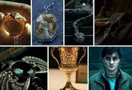
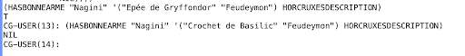

# Harry, Voldemort et Dumbledore à la recherche des Horcruxes

Un projet étudiant où Harry Potter, Voldemort et Dumbledore cherchent les Horcruxes dans une carte représentée par un espace d'état au moyen de différents types d'algorithme.  
Ceci est un projet étudiant, réalisé un temps contraint et limité et dont le développement est aujourd'hui stoppé.

## Création
14/11/2023

## Dernière modification du code
20/11/2023

## Auteur
Simon Biffe

## Contributeur
Inès Adam

### Quelles sont les règles ?

## Enoncé du problème :

Harry Potter et Lord Voldemort vont chercher les Horcruxes dans une carte. Chaque case de la carte représente une pièce ou un lieu. Harry Potter utilisera un algorithme de recherche en profondeur pour trouver et détruire des Horcruxes. Il ne pourra se déplacer que sur des cases contigues (en haut, à droite, en bas ou à gauche). Les cases grisées ne sont pas accessibles. Ainsi de l’état 22, on peut aller en 27, en 21 et en 15. Lord Voldmort quand à lui pourra se déplacer n’importe comment à l’exception des cases grisées.

Le nombre d’essai est limité à un nombre de profondeur donné (7 ici, l’entrée étant le niveau 0).
Pour ce projet, on dispose de la carte ci-dessous, le programme doit cependant pouvoir traiter n’importe quelle carte représentée de la sorte.

Chaque Horcruxe peut être détruit par une méthode de destruction unique. Voici la description des Horcruxes et des méthodes de destruction associées :

- Journal intime de Tom Jedusor. Méthode de destruction : Crochet de Basilic
- Médaillon de Salazar Serpentard. Méthode de destruction : Epée de Gryffondor
- Bague de Gaunt. Méthode de destruction : Epée de Gryffondor
- Coupe de Helga Poufsouffle. Méthode de destruction : Crochet de Basilic
- Nagini. Méthode de destruction : Epée de Gryffondor
- Diadème de Rowena Serdaigle. Méthode de destruction : Feudeymon
- Harry Potter. Méthode de destruction : Sortilège de la Mort

Les Horcruxes sont cachés dans les cases suivantes :

- Journal intime de Tom Jedusor : 8
- Médaillon de Salazar Serpentard : 12
- Bague de Gaunt : 15
- Coupe de Helga Poufsouffle : 22
- Nagini : 26
- Diadème de Rowena Serdaigle : 29

Le septième Horcruxe, Harry Potter, se déplace.

Une méthode de destruction peut détruire plusieurs Horcruxes. Quatre méthodes de destruction sont cachées dans les cases suivantes :

- Crochet de Basilic : 3
- Sortilège de la Mort : 20
- Epée de Gryffondor : 25
- Feudeymon : 32

En arrivant surs une case, il est possible de prendre une méthode de destruction s’il y en a une. Si on arrive sur une case pour la première fois, s’il y a un Horcruxe et si on dispose de la méthode adéquate alors on peut détruire l’Horcruxe (e.g. si on est sur la case 26, pour détruire le Nagini, il faut déjà posséder l’épée de Gryffondor). Il ne sera pas possible de le détruire si ce n’est pas la première fois qu’on vient sur cette case. Par exemple, si on passe une première fois sur la case 12 mais qu’on n’a pas l’épée de Gryffondor, alors il n’est pas possible de la détruire. Si on revient une seconde fois avec l’épée, il sera trop tard pour le détruire.

Lord Voldemort va également explorer la carte. A chaque déplacement de Harry Potter sur une nouvelle case, Lord Voldemort va également se déplacer (en même temps). On peut considérer que lorsque Harry revient sur ses pas, Lord Voldemort ne se déplace pas. C’est à l’utilisateur de choisir la case de Lord Voldemort. La profondeur possible est toujours de 7.

Lord Voldemort peut également collecter des armes et détruire des Horcruxes. Comme pour Harry Potter, il ne peut détruire l’Horcruxe que :

- S’il a déjà collecté la méthode de destruction adéquate et
- Si c’est la première fois qu’il vient dans cette case.

Toutefois, les règles sont différentes pour l’Horcruxe Harry Potter. Lord Voldermort peut détruire Harry Potter avec le Sortilège de la Mort s’il arrive sur la même case que lui et même s’il est déjà venu sur cette case. Si Harry Potter meurt, le jeu s’arrête.

Dumbledore peut également intervenir. Étant un sorcier très puissant, Dumbledore a la capacité de se téléporter à tout endroit qu’il a aperçu, dans le cas présent les cases adjacentes, et se déplace donc selon un parcours en largeur.

### Représentation du problème

On aura quatre listes différentes qui représenteront 1) la carte, 2) la description des Horcruxes, 3) le positionnement des Horcruxes dans la carte et 4) le positionnement des méthodes de destructions dans la carte.

Voici ci-dessous un exemple pour chacune, correspondant à la carte de référence.

(setq map '((1 12 2)(2 1 3)(3 2 4)(4 3 5)(5 4 8 6)(6 5 7)(7 8 6)(8 7 5)(12 13 1)
            (13 24 12)(15 22)(20 21 29)(21 22 20)(22 27 21 15)(24 25 13)
            (25 36 26 24)(26 25 27)(27 26 22)(29 32 20)(32 29)(36 25)))

 
(setq horcruxesDescription '(("Journal intime de Tom Jedusor" 
                                (methodeDestruction "Crochet de Basilic"))
                             ("Médaillon de Salazar Serpentard" 
                                (methodeDestruction "Epée de Gryffondor"))
                             ("Bague de Gaunt" 
                                (methodeDestruction "Epée de Gryffondor"))
                             ("Coupe de Helga Poufsouffle" 
                                (methodeDestruction "Crochet de Basilic"))
                             ("Nagini" 
                                (methodeDestruction "Epée de Gryffondor"))
                             ("Diadème de Rowena Serdaigle" 
                                (methodeDestruction "Feudeymon"))))

(setq horcruxesMap '((8 "Journal intime de Tom Jedusor")
                     (12 "Médaillon de Salazar Serpentard")
                     (15 "Bague de Gaunt")
                     (22 "Coupe de Helga Poufsouffle")
                     (26 "Nagini")
                     (29 "Diadème de Rowena Serdaigle")))

(setq armesMap '((3 "Crochet de Basilic")
                 (32 "Feudeymon")
                 (25 "Epée de Gryffondor")
                 (20 "Sortilège de la Mort")))        

## Usage

Ci-dessous, quelques exemples d'appels intéressants pour chaque fonction.  
Les structures et différentes options des paramètres sont davantages détaillés en commentaire de chaque fonction au sein du code.

Les noms map, horcruxesDescription, horcruxesMap et armesMap correspondent aux variables de test proposées plus haut. Toute variable ayant une structure similaire peut leur être substituée au sein des appels de fonction.

### Fonctions de Service:
( successeurs-valides 22 map '(26 27 28))
( methodedestruction “Nagini” horcruxesDescription)
( hasbonneArme “Nagini” '(“Epée de Gryffondor” “Feudeymon”) Horcruxesdescription)

### Fonction RechercheProfondeur:
(rechercheprofondeur 1 map horcruxesMap armesMap horcruxesDescription)
(rechercheprofondeur 24 map horcruxesMap armesMap horcruxesDescription)
(rechercheprofondeur 1 map horcruxesMap armesMap horcruxesDescription :horcruxesDetruits NIL :profondeur 2)
(rechercheprofondeur 1 map horcruxesMap armesMap horcruxesDescription :affichage "events")

### Fonction rechercheProfondeurVoldemort:
(rechercheprofondeurVoldemort 1 3 map horcruxesMap armesMap horcruxesDescription)
(rechercheprofondeurVoldemort 1 3 map horcruxesMap armesMap horcruxesDescription :affichage "log-arbre")

### Fonction rechercheProfondeur+:
(rechercheprofondeur+ 1 map horcruxesMap armesMap horcruxesDescription :profondeurMax 3)
(rechercheprofondeur+ 1 map horcruxesMap armesMap horcruxesDescription :profondeurMax 12 :affichage "events-arbre")
(rechercheprofondeur+ 24 map horcruxesMap armesMap horcruxesDescription)
(rechercheprofondeur+ 1 map horcruxesMap armesMap horcruxesDescription :horcruxesDetruits NIL :profondeur 2)
(rechercheprofondeur+ 1 map horcruxesMap armesMap horcruxesDescription :affichage "events")
(rechercheprofondeur+ 1 map horcruxesMap armesMap horcruxesDescription :profondeurMax 12 :fluxSortie "test32.txt" :affichage "events")

### Fonction rechercheProfondeurVoldemort+ :
(rechercheprofondeurVoldemort+ 1 3 map horcruxesMap armesMap horcruxesDescription)
(rechercheprofondeurVoldemort+ 1 36 map horcruxesMap armesMap
horcruxesDescription :affichage "log-arbre" :profondeurMax 9 :fluxSortie "test333.txt")

### Fonction rechercheProfondeur++:
(rechercheprofondeur++ 1 map horcruxesMap armesMap horcruxesDescription
:profondeurMax 7 :dumbledore T :caseD 1)
(rechercheprofondeur++ 1 map horcruxesMap armesMap horcruxesDescription
:profondeurMax 7 :dumbledore T :caseD 1 :modeD "parallele")

## Documentation détaillée

### Fonctions de service

#### successeurs-valides

Cette fonction prend en paramètre une case sous la forme d’un entier, une carte sous la forme d’une liste de cases, chaque case étant représentée par une liste comportant son numéro puis les numéros de ses successeurs, et un chemin parcouru sous la forme d’une liste de cases, chaque case étant représenté par son numéro.  
A partir du numéro de la case et de la carte passées en paramètre, on parcourt chaque successeur de la case, vérifie s’il a déjà été parcouru et l’ajoute aux successeurs valides. L’ordre de la liste des successeurs valides est ensuite inversé pour correspondre à l’ordre original des successeurs dans la carte et cette liste est renvoyée.  
Si une case non présente dans la carte est passée en paramètre, la fonction renvoie NIL.

#### methodeDestruction

Cette fonction prend en paramètre un horcruxe sous la forme d’une chaîne de caractère et une liste indiquant la méthode de destruction adaptée pour chaque horcruxe sous la forme d’une liste de couple (horcruxe arme) où chacun est représenté par une chaîne de caractère.  
Elle vérifie si un couple commençant par la chaîne de caractère passée en paramètre existe dans la liste des descriptions et, si c’est le cas, renvoie le deuxième élément du couple, c’est-à-dire la méthode de destruction associée. Sinon, elle renvoie NIL.

#### hasBonneArme

Cette fonction prend en paramètre un horcruxe sous la forme d’une chaîne de caractère, une liste des méthodes de destruction possédées, représentées sous la forme de chaînes de caractère, et une liste indiquant la méthode de destruction adaptée pour chaque horcruxe sous la forme d’une liste de couple (horcruxe arme) où chacun est représenté par une chaîne de caractère.  
Elle cherche au moyen de methodeDestruction la méthode de destruction associée à l’Horcruxe testé et vérifie si celle-ci fait partie de la liste des méthodes possédées, puis renvoie le résultat booléen de cette vérification. A noter que si une chaîne de caractère ne figurant pas comme Horcruxe dans la liste de description des Horcruxes est passée en paramètre, methodeDestruction renvoie NIL et hasBonneArme renvoie donc NIL elle aussi.

### Recherche en profondeur pour la recherche de Harry Potter

#### Algorithme

La principale difficulté de cette recherche en profondeur consiste à transmettre et surtout récupérer les informations à travers les différents appels récursifs.

Nous avons distingué trois possibilités :
- L’utilisation de variables globales  
Cette solution nous paraissait toutefois à éviter, notamment car ce comportement n’aurait pas forcément été très instinctif pour l’utilisateur.
- Le passage des informations modifiées par valeur de retour  
C’est de notre point de vue la solution la plus simple à mettre en œuvre mais elle peut conduire à surcharger la valeur renvoyée par la fonction. Nous l’avons utilisé pour gérer les modifications de horcruxesDetruits et armesPossedes qui sont de toute manière requises.
- L’utilisation d’effets de bord par l’exploitation de la propriété mutable des listes  
L’exploitation de la propriété mutable des listes en Lisp permet de mettre directement à jour les informations nécessaires d'un appel récursif à l'autre, sans passer par une valeur renvoyée.
Cette méthode présente plusieurs avantages :
    - Etant donné que chaque liste n’est créé qu’une unique fois, on économise de la place en mémoire
    - Puisqu’il n’y a pas de copie des valeurs de retour à faire, le nombre d’opérations à effectuer est réduit
    - On évite de “polluer” la valeur de retour en ne renvoyant que les valeurs utiles pour l’utilisateur final
    - En théorie, si l’utilisateur final souhaite tout de même récupérer la valeur finale d’une liste gérée par effet de bord, il peut le faire en passant en paramètre une liste prédéfinie et stockée précédemment dans une variable  

Nous lui reconnaissons toutefois un inconvénient, celui de modifier la valeur de liste éventuellement passée en paramètre et donc d'imposer de lui passer une copie. Cet inconvénient est toutefois réglé par l’utilisation de paramètres optionnels puisque l’utilisateur n’a plus de risque de passer une variable prédéfinie en paramètre et de la modifier sans l’avoir décidé.

Nous avons finalement effectué un compromis en gérant horcruxesDétruits et armesPossedees, qui sont de toute manière des valeurs de retour requises, par passage des informations par valeur de retour et en gérant les autres données concernées, ici seulement cheminParcouru, par effets de bord.

En résulte l’algorithme suivant :

    RechercheProfondeur
        Paramètres :
                Obligatoires :
                    case : entier
                    carte : liste (d'adjacence)
                    carteHorcruxes : liste d'association
                    carteArmes : liste d'association
                    descriptionHorcruxes : liste d'association
                Optionnels :
                    profondeur : entier (par défaut 0)
                    cheminParcouru : liste (par défaut liste vide)
                    armesPossedees : liste (par défaut liste vide)
                    horcruxesDetruits : liste (par défaut liste vide)
        Début :
            #Traitement de la case active
            Ajouter case à cheminParcouru
            armeCase <- assoc(case, carteArmes)
            horcruxeCase <- assoc(case, carteHorcruxes)
            Si armeCase :
                    Ajouter le deuxième élément de armeCase à armesPossedes
            FinSi
    Si horcruxeCase et hasBonneArme(cadr(horcruxeCase), armesPossedees, descriptionHorcruxes) :
                    Ajouter le deuxième élément de horcruxeCase à horcruxesDetruits
            FinSi

    #Recherche et traitement des successeurs valides (non déjà parcouru notamment)
            Si profondeur < 7 alors pour chaque successeur valide succ de case :
    tmp <- RechercheProfondeur(succ, carte, carteHorcruxes, carteArmes, descriptionHorcruxes, profondeur + 1, cheminParcouru, armesPossedes, horcruxesDetruits) 
    #Pas de risque de duplication des horcruxes et armes car chacun n'est positionné que sur une seule case et on ne vérifie chaque case qu'une unique fois grâce à cheminParcouru (à modifier donc si cette règle de l'unicité des horcruxes venait à changer)
                Remplacer horcruxesDetruits par le premier élément de tmp
                Remplacer armesPossedees par le second élément de tmp
            FinPour
            Renvoyer (horcruxesDetruits armesPossedes)
        Fin

#### Lisp

La fonction Lisp, nommée rechercheProfondeur dans le code associé, possède cinq étapes principales :
- La vérification de la validité des arguments passés en paramètre
- Le traitement de la case active  
On ajoute la case active au chemin parcouru puis on ajoute l’Horcruxe ou la méthode de destruction aux Horcruxes détruits ou aux armes possédées respectivement, s’il y en a un sur la case active et si l’on possède la méthode de destruction requise dans le cas d’un Horcruxe.
- L’affichage de l’état actif  
Ayant dû travailler séparément sur le projet durant un temps, nous nous sommes rendu compte au moment de fusionner le code que nous avions adopté un principe d’affichage très différent : Inès, dans une approche plus ludique, affichait les actions accompagnées de commentaires quand elles s'effectuaient, quand Simon, dans une approche de contextualisation, affichait l’état actif à chaque case.  
Plutôt que de choisir l’un des deux principes, nous avons choisi de les faire coexister en proposant à l’utilisateur de choisir un mode d’affichage au moyen d’un paramètre optionnel. Quatre modes sont finalement proposés :
    - “log”  
    Affiche pour chaque case le numéro de la case active, les horcruxes détruits et les méthodes de destruction possédées
    - “log-arbre”
    Même mode que “log” mais décale chaque affichage d’autant d’espaces que de profondeur pour mieux représenter le parcours en profondeur
    - “events”  
    Affiche les évènements rencontrés (case active, horcruxe détruit, horcruxe rencontré sans la bonne arme…)
    - “events-arbre”
    Même mode que “events” mais décale chaque affichage d’autant d’espaces que de profondeur pour mieux représenter le parcours en profondeur

Le mode par défaut est “log-arbre”.

- Le traitement éventuel des successeurs  
On vérifie que la profondeur n’a pas atteint la valeur maximale, pour l’instant fixée à 7, puis on recherche tous les successeurs qui n’ont pas déjà été parcourus. Pour chacun d’entre eux, on vérifie à nouveau qu’il n’a pas été parcouru lors d’un parcours partant d’un autre successeur, réalisé donc après la recherche des successeurs valides. Puis on appelle à nouveau la fonction pour effectuer une recherche en profondeur à partir de ce successeur en incrémentant la profondeur. On récupère la valeur de retour et on l’utilise pour mettre à jour la liste des méthodes possédées et celle des Horcruxes détruits.

- Le renvoie de la liste des horcruxes détruits et des méthodes de destruction possédées

La mise à jour du chemin parcouru par effet de bord a constitué la principale difficulté rencontrée lors du développement de cette fonction. En effet, la majorité des fonctions natives en Lisp se protègent contre les effets de bord, qui sont généralement un évènement imprévu par le développeur et non souhaité par l’utilisateur final. Ainsi, il nous a semblé comprendre que même si elles semblent modifier en place la liste passée en paramètre, que nous nommerons *alpha*, la majorité des fonctions semblables à push font une copie de *alpha*, la modifient, et font de cette copie la nouvelle valeur de *alpha*. Cependant, cette attribution n’est valable que dans la portée de variable actuelle, c’est à dire ici la fonction et toutes les fonctions appelées en son sein qui prendront *alpha* en paramètre. En conséquence, *alpha* n’aura pas changé été modifié dans la portée supérieure, où la fonction aura été appelée, que ce soit le processus principal ou un précédent appel parent de la fonction.
C’est un comportement problématique dans le sujet présent car autant on pourrait traiter la liste des méthodes de destruction ainsi, en ne faisant par exemple que des affichages lorsqu’on en récupère une, sans valeur de retour, autant la récupération des Horcruxes est souvent conditionné à la possession d’une méthode de destruction récupérée dans un appel récursif “parallèle”, qui ne serait alors pas connu.

Pour contourner ces protections mises en place par les fonctions standardes,  il nous a fallu directement remplacer au moyen de setf le cdr de la dernière cellule de la liste à modifier, ici cheminParcouru, par la case à ajouter. De plus, cette case doit être préalablement convertie en liste. Dans le cas contraire, elle remplace bien le cdr de cheminParcouru mais on ne peut plus lui ajouter de cases. Nous pensons que c’est parce qu’elle ne possède pas de cdr et remplace juste le cdr valant NIL de cheminParcouru par sa valeur, là où la conversion la transforme en une paire (case, NIL).

Si elle fonctionne en pratique, cette solution ne préserve toutefois pas tous les avantages prévus lors de l’élaboration de l’algorithme. En effet, en Lisp, une liste vide n’est pas une paire de valeurs mais la valeur NIL. Aussi, il est impossible d’en extraire, et encore moins d’en modifier, le cdr. Pour garantir le fonctionnement de la fonction même en cas de liste vide, cas généralement présent lors du premier appel de la fonction puisqu’il s’agit de l’état par défaut de cheminParcouru, nous vérifions si la liste était nulle. Si c’est le cas, nous attribuons à cheminParcouru la valeur de la case convertie en liste. Le comportement de cette liste est alors correct au sein de cette fonction et de ses appels récursifs mais sa valeur n’est pas modifiée en dehors de la fonction. Ainsi, si un utilisateur souhaite récupérer le chemin parcouru dans une variable, il ne peut pas passer une variable nulle en paramètre, il est forcé de passer une liste contenant un objet quelconque, par exemple la valeur 0, et de ne récupérer après l’appel de la fonction que le cdr de cet objet pour éliminer l’objet quelconque. Malgré nos tests et nos recherches, il nous a été impossible de trouver une solution convaincante à ce problème qui semble provenir de la nature même de la représentation des listes en Lisp.

### Lord Voldemort part à la recherche des Horcruxes

#### Algorithme

La fonction RechercheProfondeurVoldemort effectue un parcours en profondeur de la carte du jeu, représentée par la variable carte, afin de trouver et détruire les Horcruxes. La position de Harry est indiquée par la variable caseHarry et celle de Voldemort par caseVoldemort. La fonction prend également en compte une carte des Horcruxes (carteHorcruxes), une carte des méthodes de destruction (carteArmes), et une description des Horcruxes (descriptionHorcruxes).

Pendant le parcours, la fonction met à jour les listes des méthodes de destruction et des Horcruxes détruits pour Harry et Voldemort. Elle affiche par ailleurs des informations à chaque étape, en fonction du mode d'affichage spécifié.

Pour cela, nous avons réutilisé la même trame que pour la fonction RechercheProfondeur et donc toutes les hypothèses faites plus haut restent valides.

Nous sommes donc partis de la fonction RechercheProfondeur auquel il faut rajouter les arguments relatifs à Voldemort en paramètre de fonction.
La différence ici et qu’il faut être cohérent avec les méthodes possédées par Voldemort. Nous avons fait le choix de l’exclusivité des armes : une méthode possédée par un joueur ne peut pas être récupérée par un autre.

    RechercheProfondeur
        Paramètres :
                Obligatoires :
                caseHarry : entier
        caseVoldemort : entier
                carte : liste (d'adjacence)
                carteHorcruxes : liste d'association
                carteArmes : liste d'association
                descriptionHorcruxes : liste d'association
                Optionnels :
                profondeur : entier (par défaut 0)
                cheminParcouruHarry : liste (par défaut liste vide)
                armesPossedeesHarry : liste (par défaut liste vide)
                horcruxesDetruitsHarry : liste (par défaut liste vide)
        cheminParcouruVoldemort : liste (par défaut liste vide)
                armesPossedeesVoldemort : liste (par défaut liste vide)
                horcruxesDetruitsVoldemort : liste (par défaut liste vide)
        Début :
            #Vérification de la fin de partie
            Si (caseHarry = caseVoldemort) et (“Sortilège de la Mort” appartient à armesPossedeesVoldemort) :
                Arrêter le programme et renvoyer “Harry Potter tué”
            FinSi
            #Traitement de la case active de Harry
            Ajouter case à cheminParcouruHarry
            armeCase <- assoc(caseHarry, carteArmes)
            horcruxeCase <- assoc(caseHarry, carteHorcruxes)
            Si armeCase et que l’arme n’est pas possédée par Voldemort:
                    Ajouter le deuxième élément de armeCase à armesPossedesHarry
            FinSi
    Si horcruxeCase et hasBonneArme(cadr(horcruxeCase), armesPossedeesHarry, descriptionHorcruxes) :
                    Ajouter le deuxième élément de horcruxeCase à horcruxesDetruitsHarry
            FinSi

        #Traitement de la case active de Voldemort
            Ajouter case à cheminParcouruVoldemort
            armeCase <- assoc(caseVoldemort, carteArmes)
            horcruxeCase <- assoc(caseVoldemort, carteHorcruxes)
            Si armeCase et que l’arme n’est pas possédée par Harry :
                    Ajouter le deuxième élément de armeCase à armesPossedesVoldemort
            FinSi
    Si horcruxeCase et hasBonneArme(cadr(horcruxeCase), armesPossedeesVoldemort, descriptionHorcruxes) :
                    Ajouter le deuxième élément de horcruxeCase à horcruxesDetruitsVoldemort
            FinSi

    #Recherche et traitement des successeurs valides (non déjà parcouru notamment)
            Si profondeur < 7 alors pour chaque successeur valide succ de case :
            Saisir inputCaseVoldemort
    tmp <- RechercheProfondeur(succ, inputCaseVoldemort, carte, carteHorcruxes, carteArmes, descriptionHorcruxes, profondeur + 1, cheminParcouruHarry, armesPossedesHarry, horcruxesDetruitsHarry, cheminParcouruVoldemort, armesPossedesVoldemort, horcruxesDetruitsVoldemort) 
    #Pas de risque de duplication des horcruxes et armes car chacun n'est positionné que sur une seule case et on ne vérifie chaque case qu'une unique fois grâce à cheminParcouru (à modifier donc si cette règle de l'unicité des horcruxes venait à changer)
                Remplacer horcruxesDetruitsHarry par le premier élément de tmp
                Remplacer armesPossedeesHarry par le second élément de tmp
        Remplacer horcruxesDetruitsVoldemort par le troisième élément de tmp
                Remplacer armesPossedeesVoldemort par le quatrième élément de tmp
        Remplacer caseVoldemort par le cinquième élément de tmp
            FinPour
            Renvoyer (horcruxesDetruitsHarry armesPossedesHarry horcruxesDetruitsVoldemort armesPossedesVoldemort caseVoldemort)
        Fin

#### Lisp

Nous sommes donc partis de la fonction RechercheProfondeur auquel il faut rajouter les arguments relatifs à Voldemort en paramètre de fonction.
Il faut donc suivre le parcours de Harry et de Voldemort avec “caseHarry”  et “caseVoldemort”  qui vont être stockés dans “cheminParcouruHarry” et “cheminParcouruVoldemort” (vides au début). 

Les grandes étapes du code sont donc :
- Vérification du type des arguments passés en paramètre
- Test de fin de jeu  
Un premier test permettant de vérifier si Harry et Voldemort sont sur la même case et si Voldemort possède le “Sortilège de la Mort” signifiant donc la victoire de Voldemort et ainsi, la fin du jeu. Nous avons choisi d’utiliser la fonction “return-from” pour sortir directement de la boucle et renvoyer le message d’échec pour Harry.
- Traitement de la case active de Harry  
Nous reprenons ici le même code que pour RechercheProfondeur afin de rajouter la position actuelle de Harry à son chemin parcouru et de gérer la méthode possiblement acquise et/ou l’horcruxe détruit selon les armes possédées par Voldemort. En effet, ils ne peuvent pas ramasser la même méthode. Harry peut toutefois détruire un Horcruxe que Voldemort a déjà rencontré et réciproquement.
- Affichage de la case active  
Ici aussi , nous avons repris la méthode précédente avec les quatre modes possibles.
- Traitement de la case active de Voldemort  
On stocke la case de Voldemort de la même manière que pour la position de Harry, en l’ajoutant au chemin parcouru. On gère également de la même façon l’exclusivité des méthodes/ horcruxes, en prenant soin de vérifier qu’un.e n’appartient déjà à Harry.
- Affichage de la case active  
Pareillement à rechercheProfondeur plus haut.
- Le traitement éventuel des successeurs  
On vérifie que la profondeur n’a pas atteint la valeur maximale et que tous les horcruxes n’ont pas déjà été trouvés par Harry. Cela garantit que la recherche continue tant que tous les Horcruxes ne sont pas détruits.  
Si c’est le cas, on recherche tous les successeurs qui n’ont pas déjà été parcourus par Harry.   
Ensuite, on traite les cases adjacentes à celle où se trouve Voldemort pour déterminer ses possibilités de déplacement. Si ces deux conditions sont satisfaites, la fonction utilise une boucle dolist pour parcourir les successeurs valides de la case actuelle. Un successeur est considéré valide s'il n'a pas déjà été parcouru. Après avoir affiché les possibilités de déplacement de Voldemort , on demande à l’utilisateur de choisir une de ces cases pour définir le successeur de la case actuelle de Voldemort.  
Puis, on appelle à nouveau la fonction pour effectuer une recherche en profondeur à partir de ces successeurs en incrémentant la profondeur. On récupère la valeur de retour et on l’utilise pour mettre à jour la liste des méthodes possédées et celle des Horcruxes détruits pour Harry et Voldemort. On met aussi à jour à partir du retour la case de Voldemort. En effet, on rencontre sinon le problème de remontée des informations détaillé plus haut et qui ne peut cette fois-ci pas être résolu par effets de bords, les entiers étant non mutables à l’inverse des listes.

### Dumbledore et parcours en largeur

Nous avons introduit une variante de la fonction de recherche en profondeur de Harry, nommée rechercheProfondeur++ et disponible dans le code, où Dumbledore peut être ajouté à la partie.  
Cette fonction prend en paramètres obligatoires les paramètre de rechercheProfondeur et en paramètres optionnels :
- Tous les paramètre de rechercheProfondeur+
- :dumbledore, qui attend un booléen et permet de prendre (T) ou non (NIL) en compte Dumbledore dans la partie. S’il vaut NIL, le fonctionnement de la fonction est strictement similaire à rechercheProfondeur+.
- :caseD, qui attend un entier représentant la case active de Dumbledore
- :fileD, qui attend une liste de cases représentées par des entiers et qui représente la liste des successeurs à parcourir dans l’ordre
- :cheminParcouruD, qui attend une liste de cases représentées par des entiers et qui représente la liste des cases déjà parcourues par Dumbledore
- :armesPossedeesD, qui attend une liste de chaînes de caractère représentant des méthodes de destruction récoltées par Dumbledore
- :horcruxesDetruitsD, qui attend une liste de chaînes de caractère représentant des horcruxes détruits par Dumbledore
- :modeD, qui attend une chaîne de caractère et représente le mode d’ajout de Dumbledore. Deux modes existent :
    - “collab” : Dumbledore et Harry Potter coexistent sur le plateau, chaque méthode de destruction et Horcruxe ne peut être récupéré que par l’un d’entre eux. Ils peuvent donc potentiellement récupérer plus d’Horcruxes mais aussi se gêner, si l’un d’entre eux récupère la méthode de destruction nécessaire pour l’autre. Il est à noter que même si Harry Potter rencontre un Horcruxe qu’il ne peut pas détruire faute de méthode de destruction adaptée en sa possession, Dumbledore pourra le détruire lors de son premier passage sur cette case et réciproquement.
    - “parallele” : Dumbledore et Harry Potter ne coexistent pas et les mêmes méthodes de destruction et Horcruxes peuvent alors être récupérés par les deux. Ce mode permet de comparer l’efficacité de chaque type de parcours.

La valeur par défaut est “collab”.

- Traitement de la case active pour Harry Potter  
Comme dans rechercheProfondeur, on ajoute la case active au chemin parcouru, puis on ajoute l’Horcruxe ou la méthode de destruction aux Horcruxes détruits ou aux armes possédées respectivement, s’il y en a un sur la case active et si l’on possède la méthode de destruction requise dans le cas d’un Horcruxe. Toutefois, si Dumbledore est présent et en mode “collab”, on vérifie avant d’ajouter l’Horcruxe ou la méthode de destruction qu’ils ne soient pas dans les Horcruxes détruits ou les méthodes de destruction récoltées par Dumbledore.

- Traitement de la case active pour Dumbledore  
On procède de même que pour Harry, puis on ajoute à la file des cases à parcourir les successeurs valides de la case active de Dumbledore.

- Affichage des données actuelles ou des changements selon le mode d’affichage choisi

- Appels récursifs  
On vérifie que la profondeur n’a pas atteint la valeur maximale passée en paramètre, par défaut, fixée à 7, puis, comme pour rechercheProfondeur, on recherche tous les successeurs de la case active de Harry Potter qui n’ont pas déjà été parcourus. Pour chacun d’entre eux, on appelle à nouveau la fonction pour effectuer une recherche en profondeur à partir de ce successeur en incrémentant la profondeur.  
Si la file des cases à parcourir par Dumbledore n’est pas vide, on passe son premier élément comme argument pour le paramètre :caseD et la file privée de son premier élément comme argument pour le paramètre :fileD. On récupère ensuite la valeur de retour et on l’utilise pour mettre à jour la liste des méthodes possédées par Harry, la liste des Horcruxes détruits par Harry, la liste des méthodes possédées par Dumbledore, la liste des Horcruxes détruits par Dumbledore et la file des cases à parcourir.  
Cependant, si la file des cases à parcourir par Dumbledore est vide, on effectue un simple appel à rechercheProfondeur++ avec le paramètre dumbledore valant NIL. On passe toutefois armePossedeesD, horcruxesDetruitsD et modeD en paramètre dans le cas où le mode de Dumbledore serait “collab” et où Harry Potter devrait donc vérifier que les méthodes de destruction et Horcruxes n’ont pas déjà été récupérés.

- Renvoie de la liste des méthodes possédées par Harry, la liste des Horcruxes détruits par Harry, la liste des méthodes possédées par Dumbledore, la liste des Horcruxes détruits par Dumbledore et la file des cases à parcourir par Dumbledore

Nous souhaitions tout d’abord gérer la file par effets de bord, comme les chemins parcourus par Harry Potter et Dumbledore, mais la fonction pop évite, elle aussi, les effets de bords et il est possible mais complexe de gérer le décalage des valeurs d’une liste pour en supprimer le premier élément. Nous avons donc fait le choix de le gérer par valeur de retour.

Nous n’avons pas élaboré de variante similaire pour la fonction de recherche en profondeur prenant en compte Voldemort car nous avons jugé que partager les méthodes de destruction entre trois entités risquerait de trop limiter la possibilité de destruction des Horcruxes. Toutefois, cela aurait tout à fait été possible en procédant d’une manière semblable.

### Choix de la profondeur maximale

En premier lieu, nous avons choisi de permettre à l’utilisateur de choisir le niveau de profondeur maximum du parcours en profondeur de Harry. Au-delà de la facilité d’implémentation de cet ajout, il nous semblait très intéressant pour évaluer l’impact du niveau de profondeur sur les résultats obtenus pour les différentes cases, en particulier comparé au niveau de profondeur par défaut, 7.

Nous avons implémenté ce choix au moyen d’un paramètre optionnel :profondeurMax attendant un entier et ajouté au sein des fonctions rechercheProfondeur+, rechercheProfondeurVoldemort+ et rechercheProfondeur++. Le test de profondeur préalable au traitement des successeurs est alors modifié comme ceci :

    ;Vérification que la profondeur maximum n'a pas été atteinte et que tous les Horcruxes n'ont pas déjà été trouvés
    (if (and (< profondeur profondeurMax) (< (length horcruxesDetruits) 6))

### Ecriture dans un fichier

A des fins de tests et de sauvegarde notamment, nous avons souhaité offrir à l’utilisateur la possibilité d’effectuer les affichages dans un fichier plutôt que dans la console.

Nous avons alors introduit au sein des fonctions rechercheProfondeur+, rechercheProfondeurVoldemort+ et rechercheProfondeur++ un paramètre optionnel :fluxSortie attendant T ou une chaîne de caractère correspondant au chemin d’un fichier, existant ou à créer. Tous les appels à la fonction native format avec comme premier paramètre T au sein des fonctions concernées ont alors été remplacés par un appel à une nouvelle fonction afficher avec comme premier paramètre fluxSortie. Les autres paramètres ne changent pas.

Après avoir vérifié la validité des paramètres, on teste si le paramètre sortie correspond à T, le terminal, ou à une chaîne de caractère. Dans le premier cas, on effectue un simple appel à format en passant T en premier paramètre. Dans le second cas, on ouvre un fichier (ou on le crée s’il n’existe pas), on écrit à la suite de son contenu au moyen de format auquel on a passé en premier paramètre le fichier ouvert, et on ferme le fichier. L’ouverture et la fermeture du fichier se font automatiquement au moyen de la fonction with-open-file, qui ferme le fichier même en cas d’erreur.

Grâce au mot clé &rest, tous les arguments passés en paramètres après le premier sont stockés dans la liste params, avant d’être passés individuellement en paramètre à format grâce à la fonction apply.

Cette possibilité d’écriture des affichages dans un fichier est compatible avec tous les modes d’affichages précédemment présentés. Cependant, dans rechercheProfondeurVoldemort+, le listage des cases possibles de Voldemort et les dialogues de choix sont conservés dans la console pour éviter à l’utilisateur des allers et retours entre la console, pour saisir la case choisie, et le fichier sélectionné.

## Améliorations envisagées

Au niveau des vérifications de la validité des paramètres dans les différentes fonctions, nous testons le type des arguments mais pas leur structure. Pour la carte par exemple, nous pourrions vérifier s’il s’agit bien d’une liste de listes d’entiers. De même, pour les cartes des Horcruxes et des armes nous pourrions vérifier qu’il s’agit bien de listes d’associations et que leur taille est correcte (à supposer que l’on ne rajoute pas d’Horcruxe ou de méthode de destruction dans un spin-off…). Cependant, ces vérifications sont plus complexes et nous avons préféré consacrer le temps qu’aurait nécessité leur développement au perfectionnement d’autres points qui nous semblaient plus pertinents, comme le mode d’ajout de Dumbledore.

Nous aurions aussi ajouter une heuristique au parcours et appliquer un algorithme potentiellement plus efficace, comme un algorithme glouton ou A*. Nous aurions ainsi pu calculer pour chaque successeur la somme des distances de Manhattan vis-à-vis des armes non-possédées et des Horcruxes non-rencontrés dont on possède la méthode de destruction, la choisir comme heuristique et trier les successeurs par cette valeur.
